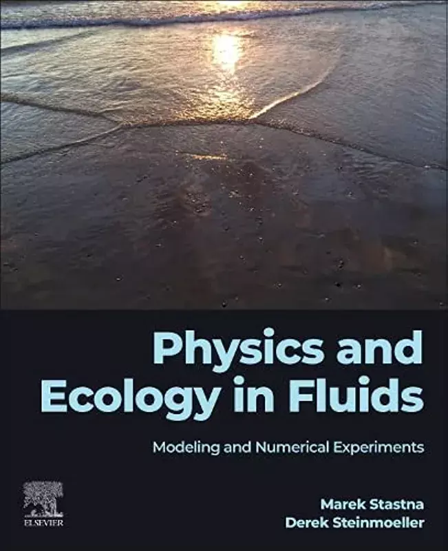

# Book (First Edition)
### by Marek Stastna and Derek Steinmoeller

## About

The book was released in February 2023. [Order](https://a.co/d/9lnHn0J) your copy!

## Obtaining the code for the book
**Updates**
Apr 30, 2023: If you received a copy of the book containing only black and white figures, please contact [Elsevier Support](https://www.elsevier.com/support) about getting a copy with colour figures.

A dependency of the python book codes, pyblitzdg, has been recently updated (v1.0.0). Consquently, more python scripts that accompany the book will be uploaded to github soon.

Feb 6, 2023: The code is currently being prepared and posted to GitHub in small portions as they become ready. An update will be posted when all codes listed in the book are available.

[Matlab sources (Latest)](https://github.com/PhysEcoFluids/matlab-codes)

[Python 3 sources (Latest)](https://github.com/PhysEcoFluids/python-codes)
